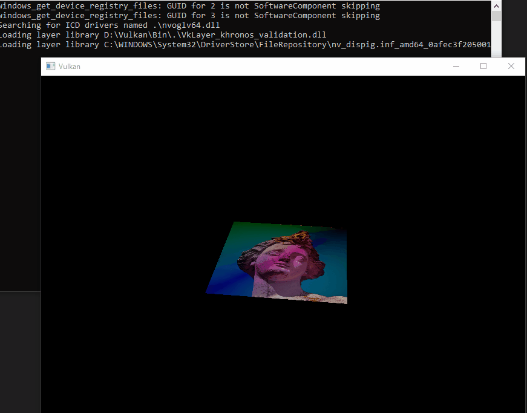

# 记得安装VulkanSDK

* 因为Dependency只下载了x64的glfw 所以只能在x64平台下跑

* shader通过glslc.exe进行转换，shader目录下存有glsl_To_SpriV.bat

## 可能存在的问题
* validation layer: loader_get_json: Failed to open JSON file：  
* 其实这个算是软件卸载的残留注册表  
* 运行 regedit，转到Computer\HKEY_LOCAL_MACHINE\SOFTWARE\Khronos\Vulkan\ImplicitLayers，删除卸载程序留下的有问题的 .json 项目

## 演示
